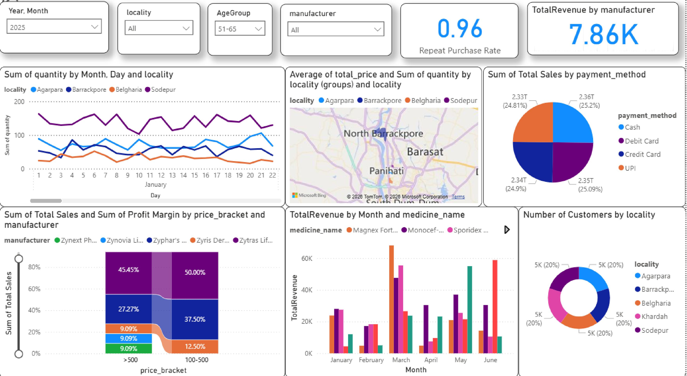
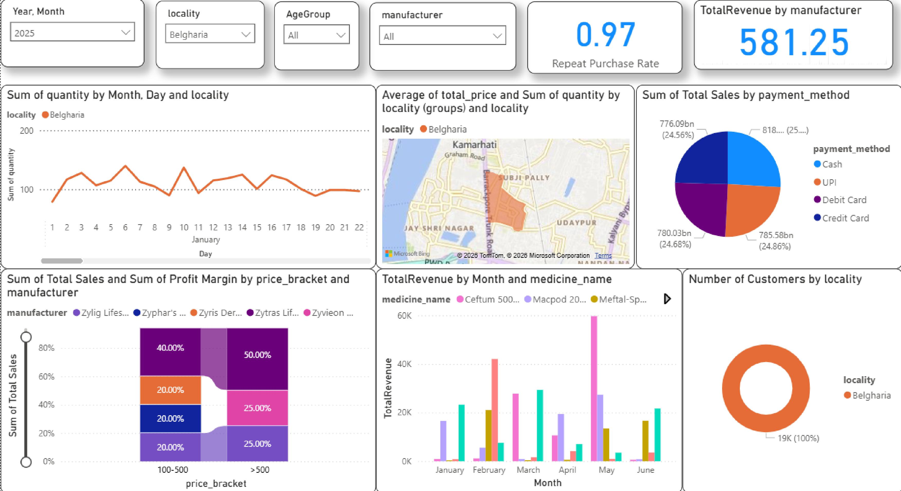
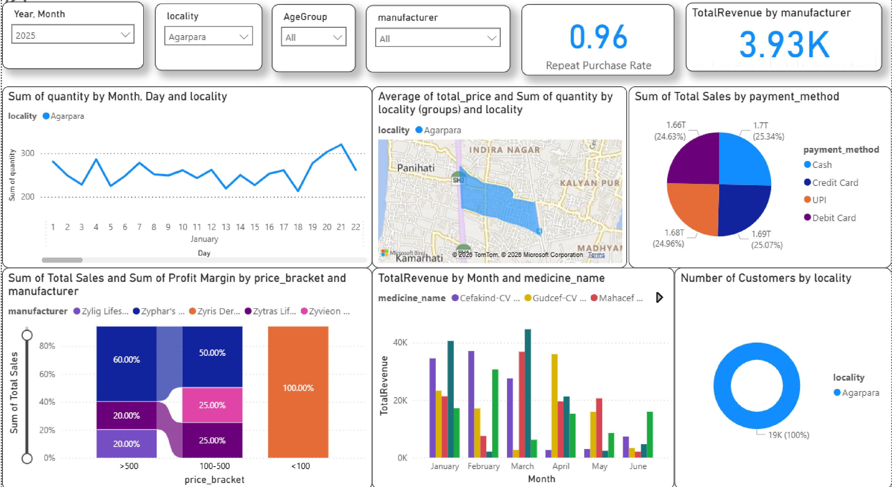
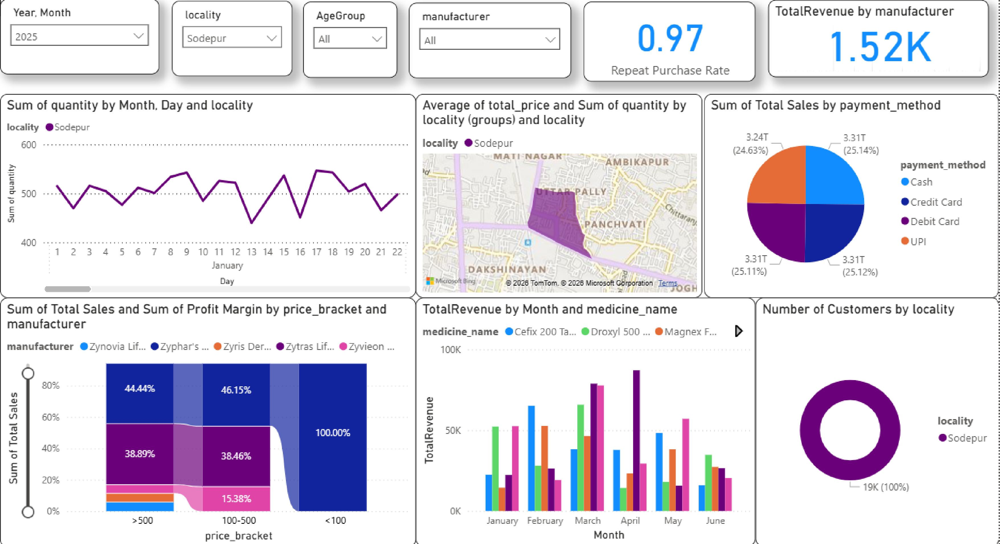
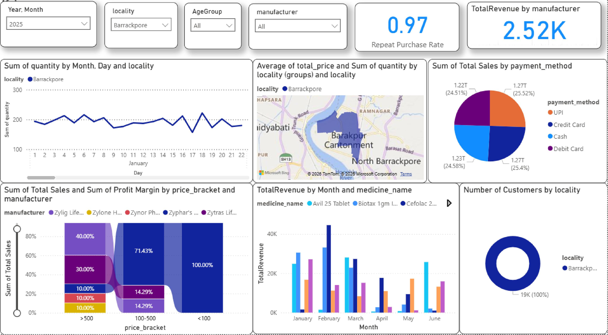
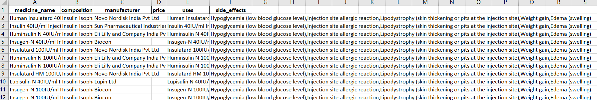
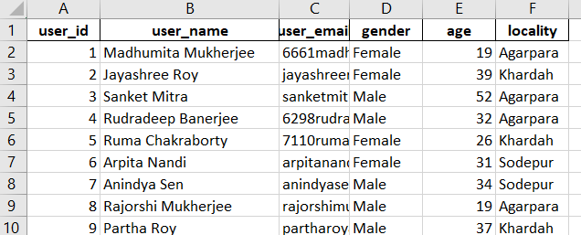
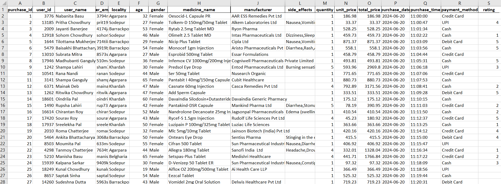

# MediAnalytics
A Power BI and Python-based Data Analytics project for a B2C real Medicine Store. Combines multiple datasets (purchases, users, medicines) to perform sales insights, Pareto analysis, statistical tests, and machine learning for churn prediction and delivery expansion analysis. Interactive dashboards with DAX enable month &amp; region filters

## Project Overview  
MediAnalytics is a **data analytics and machine learning project** that integrates a one year  real b2c medicine store dataset to uncover business insights.  
It combines **Power BI dashboards** for interactive visualization and **ML models** to identify medicine side-effects and prevalent diseases across localities.  

## Features  
-  **Sales Analytics Dashboard** – Top-selling medicines by month, region, and age group.  
-  **Geospatial Insights** – Map of medicine sales by locality.  
-  **Pareto Analysis** – 80/20 rule to identify medicines contributing most to revenue.  
-  **Machine Learning** – Customer Churn Prediction, Delivery Exapansion Analysis,and Testing Discount Bucket.  
-  **Dynamic Filters** – Interactive slicers (month, region, age group) that update all visuals in real time.  

  

## Tech Stack  
- **Data Processing**: Python (Pandas, NumPy, Matplotlib)  
- **Visualization**: Power BI (DAX queries, slicers, KPI cards, clustered column chart, maps)  
- **Machine Learning**: ScikitLearn(Logistic regression, Random Forest, XGBoost), Statictical Testing
- **Database**: Excel sheets (purchases, users, medicines)  

##  Dashboard View

>

# Data
Only few rows of each excel sheet of the original excel workbook has been shown and the whole workbook has not been included in the repo for data privacy and security

  
Medicine

Users

Purchases

>

# Customer Churn Prediction & Business Insights

##  Key Findings & Business Insights

### 1. The Churn Challenge
- **Churn rate: 5.5%** (90-day inactivity definition)
- Highly **imbalanced dataset** (94.5% active, 5.5% churned)
- This imbalance drove our choice of **Average Precision** as the primary evaluation metric over accuracy

### 2. Top Predictors of Churn

| Feature | Impact | Business Implication |
|---------|--------|---------------------|
| **Num Purchases** | Strongest negative predictor | Each additional purchase reduces churn probability by ~95% |
| **Total Quantity** | Positive predictor | High-volume buyers paradoxically show slightly higher churn risk |
| **Total Spent** | Negative predictor | Higher spenders are more loyal |
| **Credit Card Users** | Lower churn | Card users 23% less likely to churn than cash users |
| **UPI Users** | Mixed | Moderate churn reduction compared to cash |

### 3. Payment Method Analysis

| Payment Method | Churn Risk | Insight |
|----------------|------------|---------|
| **Credit Card** | Lowest (-27% coefficient) | Most loyal customers; consider loyalty rewards |
| **Debit Card** | Neutral | No significant impact on churn |
| **UPI** | Slightly reduced | Growing digital adoption; competitive with cards |
| **Cash** | Baseline (highest) | High-risk segment; target for retention campaigns |

**Decision:** Prioritize digital payment adoption (Credit Card/UPI) to reduce churn.

### 4. Locality Analysis

| Locality | Churn Risk | Strategic Implication |
|----------|------------|----------------------|
| **Barrackpore** | Lowest risk | Infrastructure-rich; ideal for logistics hub |
| **Belgharia** | Low risk | Most predictable demand (tightest HDI) |
| **Agarpara** | Slightly elevated | Potential untapped market with moderate uncertainty |
| **Khardah** | Not significant | Statistically identical to baseline |
| **Sodepur** | Baseline | Standard risk profile |

**Decision:** Focus expansion on **Barrackpore** (highest mean demand, moderate certainty) and **Belgharia** (most predictable) for risk-averse scaling.

### 5. Delivery Logistics Optimization

| Delivery Option | Cost | Time | ROI per ₹1 | Adjusted Uplift |
|----------------|------|------|------------|-----------------|
| **Train + Bicycle** | ₹14 | 3 hrs | -0.241 | -0.00034 |
| **Bike Only** | ₹25 | 50 min | -0.122 | -0.00031 |

**Key Insight:** Neither option shows positive ROI due to negative demand uplift. However, **Bike Only** performs better despite higher cost due to lower demand decay (1.7% vs 6%).

**Recommendation:** Pilot bike-only delivery in high-demand areas before expanding to train-based options.

